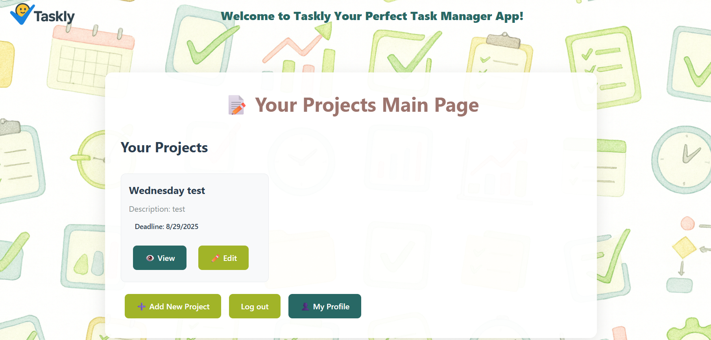

# ✅ Taskly
<p align="center">
  
</p>

Taskly is a simple yet powerful **Task Manager application** designed to help individuals organize projects, manage tasks, and meet deadlines efficiently.  
It is built with **Node.js, Express, MongoDB, and JSX** using an **MVC architecture**.

---

## 📌 Core Concepts

### 👤 User Management
- Users can **register, login, and manage their projects**.
- Users can **view, update, and delete their profiles**.

### 📂 Projects
- Each project has:
  - Title  
  - Description  
  - Deadline   
- Projects act as containers for tasks.
- Project CRUD – create, view, edit, delete projects

### 📝 Tasks
- Each task belongs to a project and has:
  - Title & description  
  - Status: *To Do or Pending*, *Completed*
- Nested tasks within projects, with status toggling

### 📅 Deadlines
- Projects have deadlines.


---

## 🏗️ Architecture
The application follows the **MVC pattern**:

- **Models**: Define data structures (Users, Projects, Tasks).
- **Views**: jsx templates render server-side HTML.
- **Controllers**: Handle logic and connect routes with models.
```plaintext
+------------------+            +------------------+            +------------------+
|      User        |            |     Project      |            |      Task        |
|------------------|            |------------------|            |------------------|
| • name           |            | • title          |            | • title          |
| • email          |            | • description    |            | • description    |
| • password       |            | • deadline       |            | • status (Bool)  |
| • projects[]     |            | • tasks[]        |            |                  |
| • tasks[]        |            +------------------+            +------------------+
+------------------+                   ▲                              ▲
                   \                   |                              |
                    \------------------┘                              |
                          User.projects[]                             |
                                                                      |
       Project.tasks[] ---------------------------------------------- ┘

                    Each Task belongs to one Project


```
## 📊 Routes Table
| Method | Route                                 | Description                             | Access |
| ------ | ------------------------------------- | --------------------------------------- | ------ |
| GET    | `/users/signup`                       | Show registration form                  | Public |
| POST   | `/users`                              | Create new user (signup)                | Public |
| GET    | `/users/login`                        | Show login form                         | Public |
| POST   | `/users/login`                        | Authenticate user                       | Public |
| PUT    | `/users/:id`                          | Update user profile                     | Auth   |
| DELETE | `/users/:id`                          | Delete own account                      | Auth   |
| GET    | `/projects`                           | List all projects                       | Auth   |
| GET    | `/projects/new`                       | Show “new project” form                 | Auth   |
| POST   | `/projects`                           | Create project                          | Auth   |
| GET    | `/projects/:id`                       | Show project detail (with “View Tasks”) | Auth   |
| GET    | `/projects/:id/edit`                  | Show “edit project” form                | Auth   |
| PUT    | `/projects/:id`                       | Update project                          | Auth   |
| DELETE | `/projects/:id`                       | Delete project                          | Auth   |
| GET    | `/projects/:projectId/tasks`          | List tasks for a project                | Auth   |
| GET    | `/projects/:projectId/tasks/new`      | Show “new task” form                    | Auth   |
| POST   | `/projects/:projectId/tasks`          | Create task under a project             | Auth   |
| GET    | `/projects/:projectId/tasks/:id`      | Show task detail                        | Auth   |
| GET    | `/projects/:projectId/tasks/:id/edit` | Show “edit task” form                   | Auth   |
| PUT    | `/projects/:projectId/tasks/:id`      | Update task                             | Auth   |
| DELETE | `/projects/:projectId/tasks/:id`      | Delete task                             | Auth   |


---

## 🛠️ Technologies Used

- **Node.js** & **Express** – server runtime and web framework  
- **MongoDB** & **Mongoose** – document database and ODM  
- **JSX (React)** – server-side templates for views  
- **Bcrypt** – password hashing  
- **JSON Web Tokens (JWT)** – stateless auth  
- **CSS** – custom styling  
- **dotenv** – environment variable management  


---

## Screensot of the app's main page



## 📂 Project Structure

```plaintext

taskly/
│
├── models/
│   ├── db.js
│   ├── User.js
│   ├── Project.js
│   └── Task.js
│
├── controllers/
│   ├── auth/
│   │   ├── userDataController.js
│   │   ├── userRouteController.js
│   │   └── userViewController.js
│   │
│   ├── project/
│   │   ├── projectDataController.js
│   │   ├── projectRouteController.js
│   │   └── projectViewController.js
│   │
│   └── task/
│       ├── taskDataController.js
│       ├── taskRouteController.js
│       └── taskViewController.js
│
├── views/
│   ├── auth/
│   │   ├── SignIn.jsx
│   │   ├── SignUp.jsx
│   │   └── Profile.jsx
│   │
│   ├── projects/
│   │   ├── Index.jsx
│   │   ├── New.jsx
│   │   ├── Show.jsx
│   │   └── Edit.jsx
│   │
│   ├── tasks/
│   │   ├── Index.jsx
│   │   ├── New.jsx
│   │   ├── Show.jsx
│   │   └── Edit.jsx
│   │
│   ├── Layout.jsx
│   └── NavBar.jsx
│
├── public/
│   ├── css/
│   │   └── style.css
│   └── images/
│       ├── backgroundImage.png
│       └── taskly-logo.png
│
├── .env
├── app.js
├── server.js
├── .gitignore
└── package.json

```


## 📈 Future Improvements
- Implement role-based access (admin vs. regular user)

- Real-time updates via WebSockets (task notifications)

- Drag-and-drop interface for task reordering

- Email reminders for upcoming deadlines

- Mobile-first design or dedicated mobile app

## 🚀 Installation Instructions

```bash
# 1. Clone this repo
git clone https://github.com/your-username/taskly.git
cd taskly

# 2. Install dependencies
npm install
# you can get them from the package.json file under "dependencies"

# 3. Set up your .env file (create from .env.example):
#    MONGODB_URI=your_mongo_connection_string
#    JWT_SECRET=your_jwt_secret
cp .env.example .env

# 4. Run the server
nodemon server.js

# 5. In your browser:
#    • HTML views at http://localhost:3000/

```